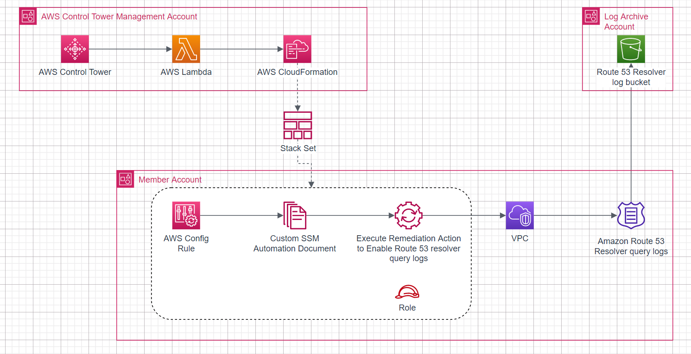

# Enable Resolver Query logs for member accounts
As part of the CISO tools onboarding (Splunk), Resolver Query logs will be enabled in all the member accounts private hosted zones  across AWS Organization. This is achieved through a Config rule that constantly checks the Resolver Query logs enabled status on every VPCs. The diagram below explains the architecture.

## Prerequisites

The following prerequisites must be in place in order to run this cloudformation template,

* An S3 bucket exists in the Log Archive account (Central Account) with trust relationship for member accounts to write the logs.

## Solution Resources

The CloudFormation template will create following resources in the member account,

* AWS SSM Document :  `Kxxxxx-CTO-AWS-EnableQueryLogs`
* AWS Config Rule  : `xxxxxx-CXX-ConfigRule-QueryLogs-Tagging`
* AWS Config Remediation Configuration : `KxxxxxCTOConfigRuleForQueryLogsTagging`
* AWS IAM Role : `Kxxxxx-ConfigRemediationRole-xxxxxxxx`

## Solution Deployment

1. Navigate to the AWS Management Account console
2. Create a CloudFormation Stackset
3. Use the CloudFormation Stackset provided as part of this documentation. CloudFormation Source File : [Route53Logsremediation.yml](https://github.com/sisodiyapradeep/Route53Resolverquerylogs_Aggregation/blob/main/Route53Logsremediation.yml)
4. Select Accounts and Regions
5. Deploy the Stackset
